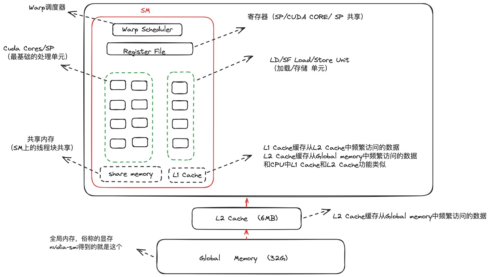
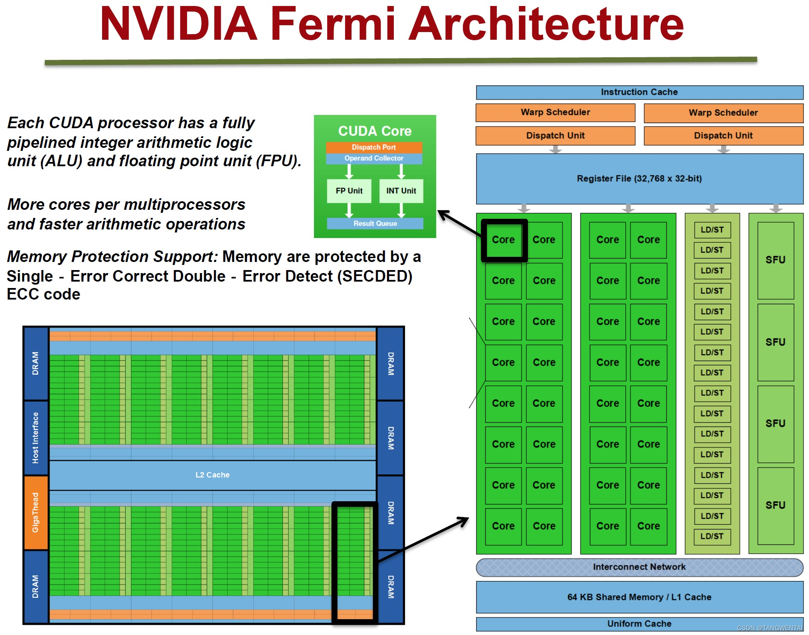
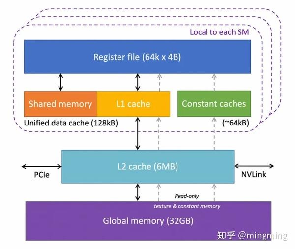
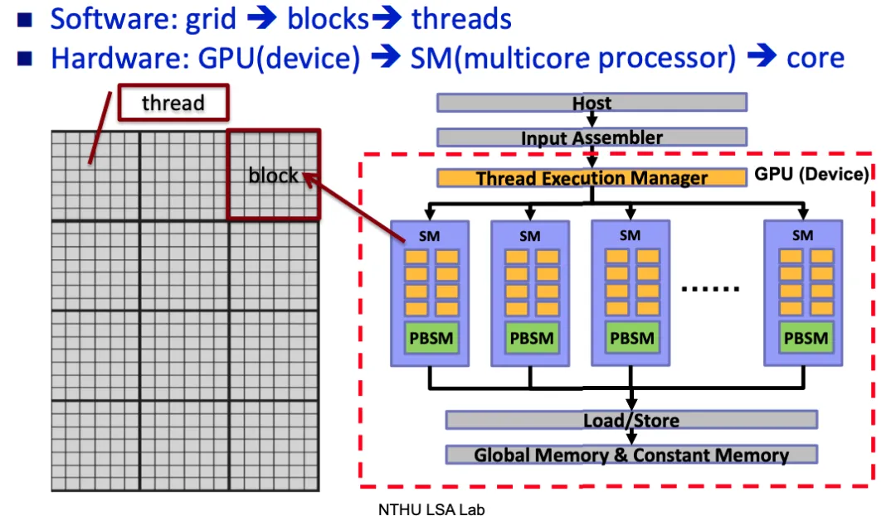
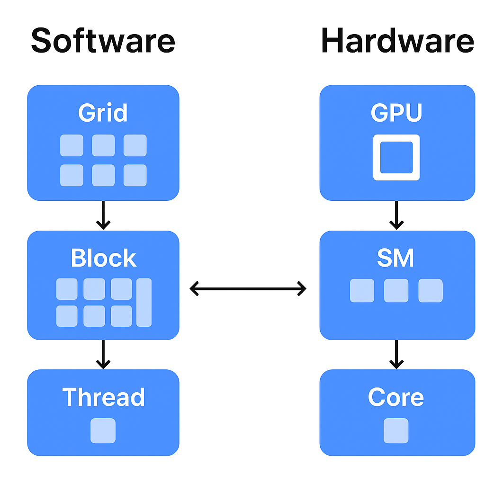

# 为什么需要GPU？(发展史)

* 一开始我们是需要最快、最准确、最高效的计算核心，因而CPU开始发展，而且随着Dennard定律 [^Dennard定律] 的证实，我们通过不断的优化制程和缓存来通过物理手段提高通算能力；
* 但随着Dennard定律在微观维度不再生效 [^量子隧穿]，我们很难高性价比的继续完成通用计算单元的升级，随着大数据、AI的发展需要，并发专精的GPU便蓬勃发展；
* 但是我们不可能只靠GPU搭建一套合理的系统，我们也终于从原先的CPU通用计算演进到“异构计算”，即同时使用 CPU + GPU（可能还有 ASIC、FPGA 等）来匹配任务特性，实现更高效的资源利用。

# GPU怎么做到比CPU更快？
这就涉及到GPU的设计理念的核心 ——“以吞吐量换取延迟”。
* GPU（图形处理器）最初是为了同时处理成千上万个像素点而设计的，像素之间几乎没有依赖关系，计算公式也一样，所以GPU能够进行大量相同或相似计算的并行执行（例如矩阵乘法、卷积、光照计算）。
* CPU则一开始就需要处理复杂逻辑、分支多、任务差异大的指令（比如操作系统调度、网页渲染、程序控制流等），将大量的资源用在延迟处理上。

所以CPU是串行的处理复杂逻辑的算力，单次处理快但成本高，核心是处理因为自己太快导致的延迟问题；而GPU是牺牲灵活性与延迟为代价换来更高的处理速度的算力，两者相辅相成。不是说CPU不能用来做大模型计算，只是成本太高。

| 特性    | CPU           | GPU              |
| ----- | ------------- | ---------------- |
| 主要目标  | 延迟最小          | 吞吐量最大            |
| 核心数量  | 少（4–64）       | 多（上千）            |
| 每核复杂度 | 高（控制强、cache大） | 低（控制弱、算力密集）      |
| 并行方式  | 多任务并行（MIMD）   | 大规模数据并行（SIMT）    |
| 内存延迟  | 低             | 高（但能隐藏）          |
| 适合任务  | 分支复杂、逻辑控制     | 计算密集、数据并行        |
| 示例任务  | 浏览器、数据库、操作系统  | 神经网络训练、图像处理、矩阵乘法 |

# 那TPU是什么？为什么有GPU还需要TPU？
因为GPU通用但不极致，TPU实际上就是针对深度学习进行了彻底的优化，能耗比和计算密度更高，专用于新时代AI场景。
* GPU 就像“多功能跑车”——能跑得快，能上赛道，也能上街。
* TPU 就像“高铁列车”——只能在固定轨道上跑，但在这条轨上极致高效。

| 对比维度           | GPU（Graphics Processing Unit）   | TPU（Tensor Processing Unit）     |
| -------------- | ------------------------------- | ------------------------------- |
| **最初用途**       | 图形渲染 → 通用并行计算（GPGPU）            | 专为神经网络矩阵运算而生                    |
| **计算特点**       | 高度并行、灵活，可运行各种算法（图形、物理、AI）       | 极度专用，针对矩阵乘加（MatMul）优化           |
| **硬件结构**       | 数千个通用CUDA核心 + 高速显存              | 矩阵乘法单元（MXU）+ 高带宽内存              |
| **编程生态**       | CUDA、OpenCL、PyTorch、TensorFlow等 | TensorFlow/XLA 优化编译器            |
| **灵活性**        | 很强，可适应各种任务                      | 弱，几乎只能跑深度学习推理/训练                |
| **能效比（性能/功耗）** | 一般                              | 极高（Google 内部统计可达 GPU 的 15–30 倍） |
| **应用场景**       | 通用AI训练、科学计算、图形渲染                | 大规模AI推理、Google内部AI云服务           |

# 那随着GPU的发展，是不是可以取代CPU的位置呢？
因为 GPU 目前本质上还是一个协处理器，指令集不够复杂，需要CPU调度，所以暂时完成不了一家独大的任务。 所以CPU 不会消失，但它的“权力”会缩小，角色会变化。
* CPU 像一个聪明的“经理”，能快速决策、灵活应对；
* GPU 像一群“工人”，一次能处理成千上万份相同的任务，但不懂变通；

| 对比项  | CPU                     | GPU             |
| ---- | ----------------------- | --------------- |
| 定位   | 系统的“大脑”，负责逻辑与控制         | 计算加速器，负责大规模并行运算 |
| 架构   | 少量强核（几核几十线程）            | 大量弱核（几千至上万个线程）  |
| 特长   | 通用逻辑、控制流复杂、分支多          | 数据并行、吞吐量高       |
| 通信方式 | 通过 **PCIe 总线** 与 GPU 通信 | 被动执行 CPU 下发的指令  |
| 执行模式 | 顺序执行（串行为主）              | 并行执行（批量线程）      |

所以将来可能CPU和GPU、TPU等组件需要共同存在，而我们就像钱学森先生所说的那样，一个可靠的系统不需要每一部分都做到100%，而是通过设计可靠的架构来保证。

# GPU的基础架构和运行流程又是怎么样的？
## 首先是总体的架构

从图中可以看出，GPU在计算或者说物理架构上，由以下部分组成：
* SM（Streaming Multiprocessor）流式多处理器
  * CUDA Core：通用算术逻辑单元（执行加法、乘法、逻辑运算）
  * Tensor Core：矩阵/张量乘法加速单元
  * SFU（Special Function Unit）：计算特殊数学函数，如 sin、cos、sqrt、rsqrt、exp、log 等
  * LD/ST Unit（Load/Store Unit）：负责从显存（global memory）或共享内存中加载/写回数据
  * Register File：寄存器组保存线程数据，每个线程的本地寄存器存储
  * Warp Scheduler + Dispatch Unit：线程束调度与指令分发
  * Instruction Buffer / Decode Unit：指令缓存与译码
  * Shared Memory/L1 Cache：片上共享存储，用于线程块间通信
* 全局显存（Global Memory）

各个计算Core就是主要的计算资源，按照之前的对比，实际计算逻辑比较简单，可以高并发。着重介绍下通过多层缓存来加速计算的内存架构。

GPU 的内存架构是一套“近小快、远大慢”的层次系统。 从寄存器 → Shared Memory → L1/L2 Cache → Global Memory， 每层延迟递增，但容量也递增（低延迟存储成本高）。 GPU 通过合并访存、Warp 调度和Shared Memory 重用， 在极高延迟的显存访问下仍能保持高吞吐性能。

至于具体的延迟到什么程度，可以看下表：

| 存储层次                         | 所在位置     | 特点                 | 延迟（Ampere示例） |
| ---------------------------- | -------- |--------------------| ------------ |
| **寄存器（Register File）**       | 每个 SM 内  | 每个线程独占，最快          | 几个 cycle     |
| **共享内存（Shared Memory）**      | 每个 SM 内  | 一个 Block 内线程共享，速度快 | ~34 cycle    |
| **L1 Cache**                 | 每个 SM 内  | 临时缓存频繁访问数据         | ~34 cycle    |
| **L2 Cache**                 | 所有 SM 共享 | 多个 SM 之间共享数据       | ~200 cycle   |
| **全局内存（Global Memory / 显存）** | GPU 芯片外  | 大容量但很慢             | ~380 cycle   |
| **常量内存（Constant Memory）**    | 全局可读     | 存放固定参数，由CPU直接操作    | 中等延迟         |

## GPU的硬件和软件流程

可以看出：
* 硬件层面分为：GPU -> SM -> Core
* 软件层面（CUDA）分为：grid -> blocks -> threads

| 软件层级       | 对应硬件层级                       | 特点                                  |
| ---------- | ---------------------------- |-------------------------------------|
| Grid（网格）   | GPU（设备）                      | 所有线程集合，Grid 中的 block 被分配到不同的 SM 上执行 |
| Block（线程块） | SM（Streaming Multiprocessor） | 最小调度/资源分配单位，一个 Block 只能 在一个 SM 上执行（但一个 SM 可以同时执行多个 Block）                        |
| Thread（线程） | CUDA Core                    | 最小执行单元                              |

[^Dennard定律]: 当晶体管特征尺寸缩小时，其功率密度保持恒定。（晶体管变小 → 电压变低 → 发热不变 → 可以塞更多 → 性能提升）
[^量子隧穿]: 当晶体管变得非常非常小（纳米级别，约是头发丝直径的十万分之一）时，电子开始“不老实”了，就像墙变得太薄，小球能“穿过去”一样，电子也能穿过晶体管的绝缘层，即使电源没开，它也偷偷“漏电”，这就是所谓的 量子隧穿效应（Quantum Tunneling）。
