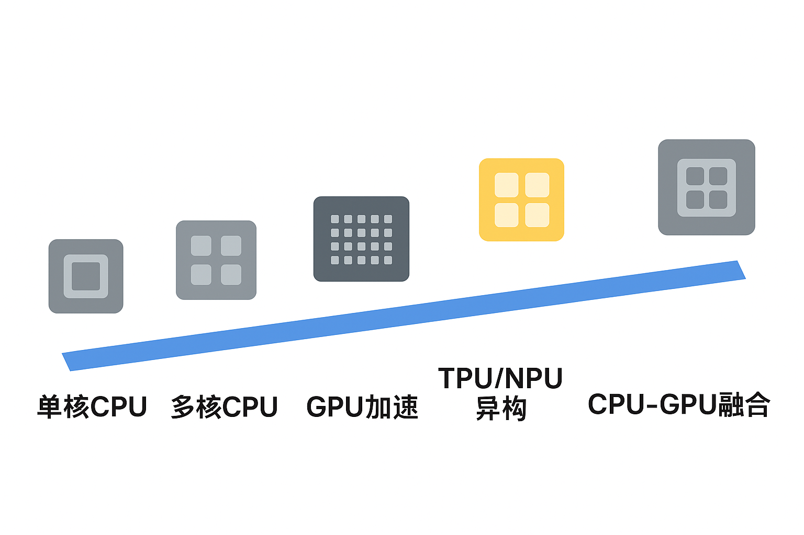

# 为什么需要GPU？(发展史)
* 一开始我们是需要最快、最准确、最高效的计算核心，因而CPU开始发展，而且随着Dennard定律 [^Dennard定律] 的证实，我们通过不断的优化制程和缓存来通过物理手段提高通算能力；
* 但随着Dennard定律在微观维度不再生效 [^量子隧穿]，我们很难高性价比的继续完成通用计算单元的升级，随着大数据、AI的发展需要，并发专精的GPU便蓬勃发展；
* 但是我们不可能只靠GPU搭建一套合理的系统，我们也终于从原先的CPU通用计算演进到“异构计算”，即同时使用 CPU + GPU（可能还有 ASIC、FPGA 等）来匹配任务特性，实现更高效的资源利用。
|时间阶段|计算硬件阶段|代表架构 / 事件|核心发展方向|技术特征|
|----|----|----|----|----|
|1970s–1990s|CPU 时代|Intel 8086, Pentium|制程微缩 + 主频提升|单核串行执行，主频持续提升（GHz级）

# GPU怎么做到比CPU更快？

[^Dennard定律]: 当晶体管特征尺寸缩小时，其功率密度保持恒定。（晶体管变小 → 电压变低 → 发热不变 → 可以塞更多 → 性能提升）
    
[^量子隧穿]: 当晶体管变得非常非常小（纳米级别，约是头发丝直径的十万分之一）时，电子开始“不老实”了，就像墙变得太薄，小球能“穿过去”一样，电子也能穿过晶体管的绝缘层，即使电源没开，它也偷偷“漏电”，这就是所谓的 量子隧穿效应（Quantum Tunneling）。
