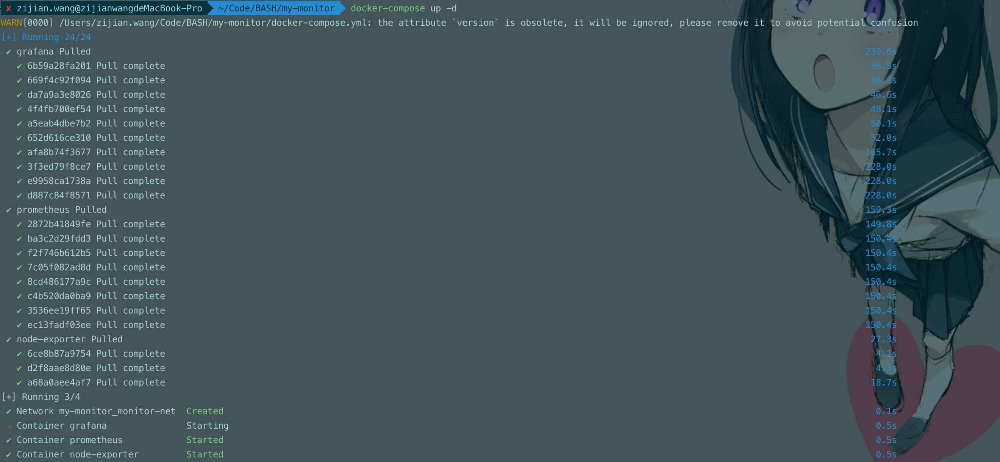
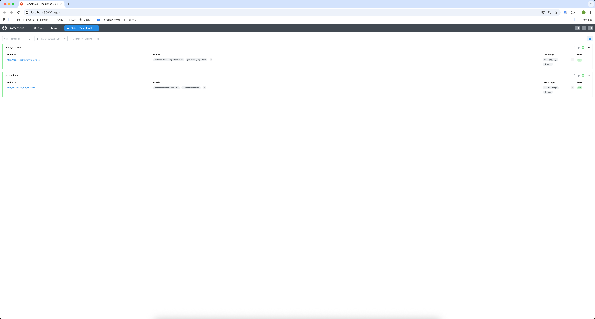
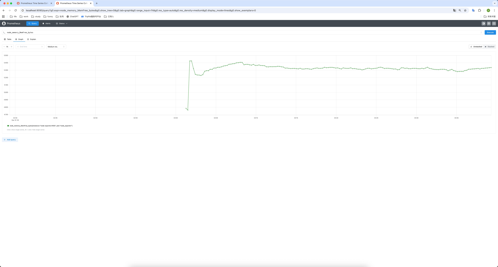
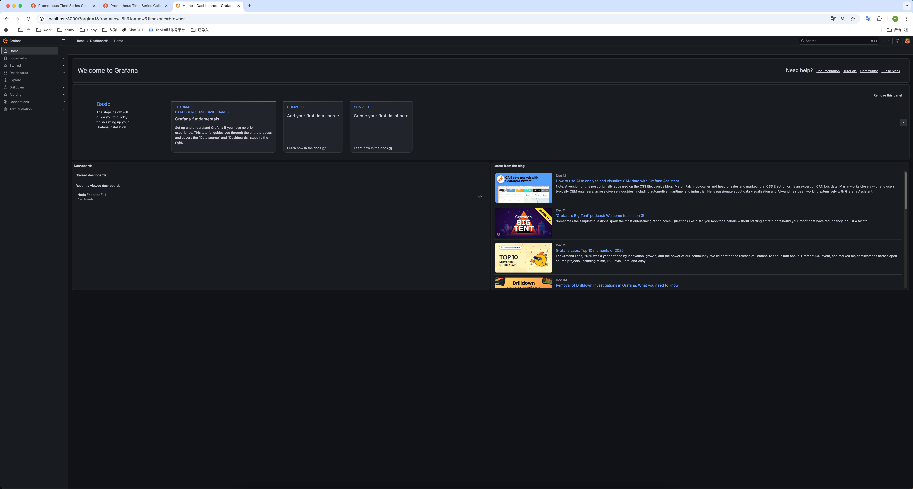
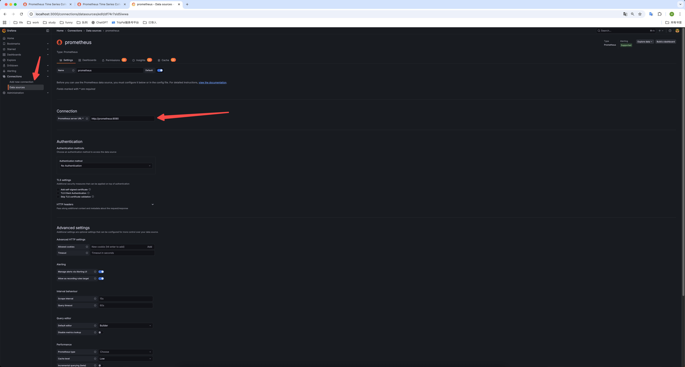
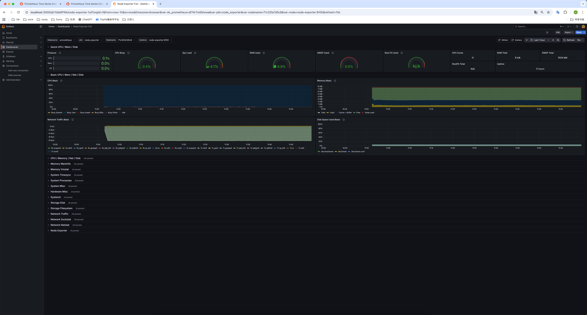

# Prometheus搭建以及学习实践
## 第一步：准备配置文件夹
请在电脑上新建一个文件夹（例如 my-monitor），然后在里面创建两个文件。
1. 创建 prometheus.yml
   这是 Prometheus 的心脏，告诉它去哪里抓取数据。 
```
global:
  scrape_interval: 15s # 每 15 秒抓取一次数据

scrape_configs:
  - job_name: 'prometheus'
    static_configs:
      - targets: ['localhost:9090']

  - job_name: 'node_exporter' # 我们的监控目标
    static_configs:
      - targets: ['node-exporter:9100'] # Docker 内部网络地址
``` 

2. 创建 docker-compose.yml
   这是启动脚本，定义了三个容器如何运行。
```
version: '3.8'

services:
  prometheus:
    image: prom/prometheus:latest
    container_name: prometheus
    volumes:
      - ./prometheus.yml:/etc/prometheus/prometheus.yml
    ports:
      - "9090:9090"
    command:
      - '--config.file=/etc/prometheus/prometheus.yml'
    networks:
      - monitor-net

  node-exporter:
    image: prom/node-exporter:latest
    container_name: node-exporter
    ports:
      - "9100:9100"
    networks:
      - monitor-net

  grafana:
    image: grafana/grafana:latest
    container_name: grafana
    ports:
      - "3000:3000"
    networks:
      - monitor-net

networks:
  monitor-net:
    driver: bridge
```

## 第二步：启动服务
打开终端（Terminal 或 CMD），进入 my-monitor 文件夹，运行：
```
docker-compose up -d
```
等待几秒钟，直到看到三个 Started 或 Running。


## 第三步：体验 Prometheus (底层视角)
我们先看看数据有没有被抓上来。
1. 访问 Targets 页面： 打开浏览器访问：http://localhost:9090/targets

观察状态，你应该能看到 node_exporter 的状态是绿色的 UP。如果是 UP，说明 Prometheus 已经成功连接上了 Exporter 并开始拉取数据了。
2. 尝试查询 (PromQL) <br>
点击顶部的 Graph 菜单。 在搜索框输入以下内容并点击 Execute： `node_memory_MemFree_bytes`

这里看到的数字就是你电脑当前剩余的内存（字节数）。Prometheus 存储的就是这些原始的时序数字。

## 第四步：配置 Grafana (可视化视角)
光看数字太累，我们用 Grafana 把它变成图表。
1. 登录 Grafana： 访问：http://localhost:3000
<br>默认账号：admin
<br>默认密码：admin (首次登录会让你改密码，可以点 Skip 跳过)
   添加数据源 (Connect Data)：


2. 在左侧菜单找到 Connections -> Data Sources。
<br>点击 Add data source。
<br>选择 Prometheus。
<br>关键一步： 在 Prometheus server URL 栏输入： http://prometheus:9090 (注意：这里不能填 localhost，因为是在 Docker 容器内部通信，必须用服务名 prometheus)。
<br>拉到最下方点击 Save & test。如果显示绿色的 "Successfully queried..." 就成功了。


3. 导入仪表盘 (Dashboard)：
<br>点击右上角的 + 号 -> Import dashboard。
<br>在 "Import via grafana.com" 的框里输入 ID：1860 (这是一个非常经典的 Node Exporter 官方看板)。
<br>点击 Load。
<br>在底部的 Prometheus 下拉框选择刚才创建的数据源。
<br>点击 Import。
