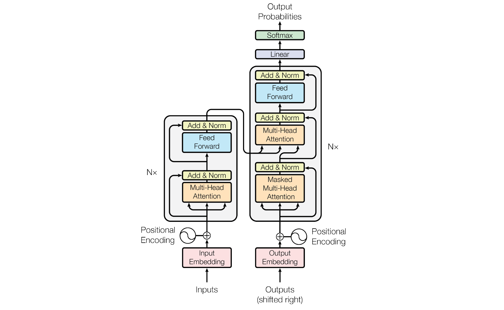

# 什么是Transformer？
Transformer是一种通用的序列建模和特征提取架构（比如一句话由多个词组成，就是序列），其创新点在于设置了`自注意力机制`来融合全局信息，能够聚焦上下文的同时不遗忘历史信息，并且摒弃了之前序列处理方法中顺序执行的计算模式，利用`并行化程度极高`的编码器-解码器（Encoder-Decoder）结构来处理序列数据。

# 其比传统模型优化在哪些地方从而在NLP任务中大放异彩？
核心优势还是在`自注意力机制`，这才是Transformer的灵魂。它计算序列中任意两个元素之间的“关联度”，其工作流程如下：
* 对于输入序列中的每个词，它生成三个向量：查询向量（Query）、键向量（Key） 和 值向量（Value）。
  *   Query (我)： “我想了解谁？” 
  *   Key (猫，吃，鱼)： “我是关于什么的？” 
  *   Value (猫，吃，鱼)： “我的实际信息是什么？”
* 计算关联：用“我”的Query去匹配“猫”、“吃”、“鱼”的Key，得到一组注意力分数（相关性分数）。这就像是问：“‘我’这个词与‘猫’、‘吃’、‘鱼’分别有多相关？”
* 加权求和：用这些分数作为权重，对对应的Value进行加权求和，得到“我”这个词在这个上下文中的新表示。这个新表示融合了全局信息。
* 关键：这个过程对序列中的每个位置同时进行，并且每个位置的新表示都直接依赖于序列中所有位置的原始表示。这实现了真正的全局建模。

| 特性 |RNN / LSTM（传统王者）|	Transformer（新范式）| 	Transformer优势带来的影响                 |
|-----------------------------|-------------------|-------------------------------------|-------------------------------------|
|信息传递方式	|`顺序传递`。计算第t个词时，必须等待第t-1个词的隐藏状态。信息像接力棒一样传递，`长距离依赖容易衰减或丢失`。	| `并行全局访问`。所有词`同时`计算自注意力，每个词都能直接“看到”整个句子。 |	解决了长距离依赖的根本难题。无论两个词相隔多远，它们之间的关联计算都是直接的，这使得模型能更好地理解复杂的句法、指代关系。|
|计算并行度	|`极低`。必须按时间步顺序计算，无法充分利用GPU的并行计算能力。	|`极高`。整个序列的注意力计算可以表示为几个大型矩阵乘法，GPU可以完美并行加速。|	训练速度飞跃。处理大数据集时，训练时间从几周缩短到几天甚至几小时。|
|模型容量与稳定性	|深层RNN存在严重的梯度消失/爆炸问题，难以训练非常深的网络。|	引入了残差连接和层归一化，使得模型可以堆叠得非常深（如12、24、96层），而不易出现梯度问题。|	表达能力极强。更深的网络能学习更复杂、更抽象的特征表示。|
|灵活性|	结构相对固定，处理可变长度输入/输出时有一定限制。|	理论上仅由注意力分数驱动，对序列长度的变化适应性强。可以处理非常长的上下文（尽管早期有长度限制，后续改进如Transformer-XL等已极大扩展）。|	为后续突破性模型铺路。如BERT（仅用编码器）、GPT（仅用解码器）、T5等，都基于Transformer模块化构建。|

# Transformer目前主要用在哪些场景呢？
Transformer本身由`Encoder-Decoder`架构组成，但近年来，去掉Encoder的`Decoder-only`架构和去掉Decoder的`Encoder-only`架构也有了很多应用，所以我们先简单理解一下Encoder、Decoder的作用，再考虑传统Transformer及其变体在各个场景中的应用。  

| 架构                          | 组成                | 机制理解                                                                                                                                                                              | 适用场景                                                                                               |
|-----------------------------|-------------------|-----------------------------------------------------------------------------------------------------------------------------------------------------------------------------------|----------------------------------------------------------------------------------------------------|
| Encoder-only（Transformer变体） | Encoder         | 擅长`理解`与`分析`，它采用`双向自注意力`，能同时看到某个词左右两边的全部上下文，从而生成富含上下文信息的词表示,适合需要`深度理解输入`的任务。  Encoder能深度理解输入文本的语义和句法结构，其双向注意力机制能让每个词充分融合左右上下文信息，从而做出准确的分类或判断。                              | 主要代表是BERT等，能够适用:`文本分类`（情感分析、新闻分类、垃圾邮件过滤）、`命名实体识别`、`自然语言推理`（判断两个句子的逻辑关系）、`提取式问答`（从给定文本中抽答案）等分析总结类任务 |
| Decoder-only（Transformer变体） | Decoder     | 擅长`生成`与`预测`。它采用`掩码自注意力`（只能看到左侧信息），保证生成过程是自回归的（像写文章一样，写下一个词时只知道之前的词）。适合`序列生成`任务。  Decoder能够基于已生成的所有上文生成下一个词，是典型的自回归生成任务，而且通过海量数据预训练，Decoder学会了语言的概率分布和世界知识，从而能流畅地生成连贯、新颖的文本。 | 主要代表是GPT系列、LLaMA、ChatGPT等所有自回归大语言模型，能够适用：`文本生成`（创作、续写、摘要、翻译）、`对话系统与聊天机器人`、`代码生成与补全`、`思维链推理`等生成类任务  |
| 传统Transformer               | Encoder + Decoder | 擅长`转换`与`映射`。先由Encoder理解输入，再由Decoder根据这个理解生成输出。适合输入和输出在形式和长度上可能不同的复杂任务。  Encoder将输入信息压缩成一个丰富的中间表示，Decoder再基于此表示和已生成的内容，逐步构造出全新的输出序列。 | 主要代表是原始Transformer、T5、BART，能够适用：`机器翻译`（源语言编码，目标语言解码）、`文本摘要`（原文编码，摘要解码）、`问答生成`（知识背景编码，答案句解码） |

# 那GPT为什么不是完全基于Transformer架构呢？
主要还是适用场景和Transformer不完全匹配。  
因为OpenAI团队发现语言模型的根本任务，是预测下一个词的概率分布：`P(下一个词 | 之前的所有词)`，这与Transformer中Decoder的掩码自注意力机制在形式上完全一致。Decoder本就是为“在给定上下文后生成下一个词”而设计的。
而Encoder的双向注意力（能看到前后所有词），虽然对理解句子含义非常强大，但它破坏了“预测下一个词”这个任务的自回归因果结构，因此，从第一性原理出发：一个纯粹的自回归语言模型，最自然、最匹配的架构就是Decoder-Only。  
所以OpenAI团队移除了Encoder，并对剩余的架构进行了如下调整：
* 将Decoder中与Encoder有关的一个“交叉注意力层”移除，只剩下一个堆叠了多层、仅包含掩码自注意力层和前馈神经网络的“纯Decoder”架构。
* 他们对位置编码和层归一化的放置方式进行了优化（采用了“Transformer Block”的经典结构），使得模型更稳定，更适合大规模训练。

简言之，GPT的探索路径可以概括为： 目标（通用语言模型）→ 匹配任务（自回归生成）→ 选择最适配的组件（Transformer-Decoder）→ 删除无关部分（交叉注意力）→ 优化剩余部分 → 形成“Decoder-Only”架构。    
在BERT出现之前，NLP的主流范式是“针对不同任务设计不同架构”。大家习惯性地认为，一个强大的模型需要复杂的、针对性的结构。而OpenAI敢于放弃了对完整句子结构的瞬时全局感知，换来了生成文本时的严格因果律和流畅性，这种“少即是多”的思想，在当时需要很大的魄力。

# 那Decoder在GPT的应用中也展现出来很强的语义理解能力，那Decoder和Encoder是不是没有太大区别？
现代Decoder-only模型（如GPT-4）确实展现出了惊人的语义理解能力，但这并不意味着Encoder和Decoder完全等价，或者Encoder失去了价值。  
* 首先为什么Decoder看似拥有了Encoder的思考总结能力呢？  
目前chatgpt等模型似乎也有了“思考”的流程，但这实际上是一种统一于自回归的`涌现理解`（也就是`Prompting`的能力），这一过程是大规模自监督预训练的意外收获而并非主动设计，其间接地强制模型学习语义和世界知识，其理解是推理式的，所以其展现出来的思考其实也是一种`序列推理`，GPT并没有人类的主观意识或真正的思考意图。模型内部发生的一切都归结为`持续的数学上的概率计算和高维向量的转换`，
  然而由于其规模和训练数据的广度，这些概率计算能够模拟复杂世界的逻辑关系和解题路径，从而产生了类似于“推理”或“思考”的宏观现象，对gpt来说流程就好像下面的表格：

  | 术语                    | GPT 中的含义                                                        | 机制的本质                                     |
  |-----------------------|-----------------------------------------------------------------|-------------------------------------------|
  | 预测 (Prediction)	基本机制。 | 模型根据前面所有已知的 Token，计算 下一个 Token 的概率分布。这是模型在底层运行的 唯一 核心任务。	       | 基于参数权重的统计概率计算。                            |
  | 推理 (Reasoning)	涌现行为。  | 模型通过多步预测，模拟 复杂问题的逻辑和结构。例如，在解数学题时，它不是一次性得到答案，而是预测出第一步、再预测第二步...	 | 序列模式的重现。 遵循在预训练数据中学到的逻辑和解题步骤序列。           |
  | 思考 (Thinking)	宏观现象。   | 对模型进行复杂 Prompting（如“让我们一步步思考”）时，其生成了一系列看似合理的内部逻辑步骤。	            | 提示驱动的推理序列。 是模型在执行一种特定的、基于 Prompt 的“推理”任务。 |
    举一个decoder思考的例子，当提问“请解释量子力学，并给出一个生活中的例子。”时：
  *     第一步预测： 模型预测：“量子力学是...”
  *     第二步预测： 此时，模型不仅仅是随机预测下一个词，它必须根据 Prompt 中设置的 “解释” 约束，以及前面已经生成的 “量子力学是...” 的上下文，来预测最符合解释结构的下一个词。
  *     约束的累积： 当模型生成到一半时，它会不断回顾整个 Prompt (解释量子力学 + 给一个生活中的例子)，以及前面已生成的文本。
  *     方向的锁定： 每一个新生成的 Token 都进一步 限制 了后续 Token 的生成方向。例如，一旦生成了“解释”部分，模型就会被引导去生成一个 “例子”。B. Chain-of-Thought (CoT) 的证明“思维链”（Chain-of-Thought, CoT） 技术正是利用了这一点。当我们提示模型 “让我们一步步来思考” 时：我们强迫模型将一个复杂的推理过程 外化 为一个 序列。模型在生成这个序列（如 $P_1, P_2, P_3, ...$）时，每一小步都成为了后续步骤的 强有力上下文和约束。
  所以Decoder的思考其实只是基于已有Token的不断推理。
* 那Encoder是如何思考的呢？
  Encoder和Decoder的“思考”区别其实如下所示，可以看出Encoder其实更需要上下文信息，做出的文本理解是更具体和全面的，而Decoder实际上更概率性。  
 
  | 维度                    | Encoder                                                        | Decoder                                     |
  |---------------------|----------------------------------------------------------------|-------------------------------------------|
  | 信息访问方式 | 全知视角：同时看到所有信息，可直接进行全局优化	      | 渐进视角：从左到右处理，理解是“推测性”的                            |
  | 理解过程 | 静态分析：一次性完成，专注建立最准确表示 | 动态构建：在生成过程中逐步建立和修正理解 |
  | 认知负荷 | 专注理解：单一任务，资源集中于深度分析 | 理解+生成：需同时处理理解和生成，资源被分配 |
  | 架构支持 | 原生支持：双向注意力天生为理解设计 | 间接实现：理解是生成的副产品，不是原生设计目标 |
  所以Decoder是在“猜”下一个token的同时“顺便”理解，而Encoder是专门为了理解而构建。

# 那GPT如果增加上Encoder是不是效果更好，为什么不这么尝试一下呢
OpenAI并非没有尝试或考虑过，但最终坚持纯Decoder路线，是基于以下几个深刻的理由：
1. 主要是场景和目标的不同：GPT的核心目标是 “流畅自回归生成”，它应该模拟的是人类对话或写作时的思维过程：根据已有的话，自然而然地接着说下一句。这是一个 单向、因果、序列化 的过程，增加Encoder意味着引入一种 “理解-规划-再生成” 的模式。
Encoder先对整个输入进行深度、双向的理解（像BERT那样），然后Decoder基于这个理解去生成。这更像是先写提纲再写作文，虽然可能更严谨，但会损失生成过程的即时性和灵活性。
2. 在总参数量固定的情况下，纯Decoder架构将所有参数都用于优化 “生成” 这一件事。如果加上Encoder，一部分宝贵的参数就要被分配给“理解”模块，而这些参数在生成最终答案时可能没有被完全利用。 
3. 训练一致性：GPT的训练目标（预测下一个词）极其纯粹统一。加入Encoder后，需要设计更复杂的预训练任务（如让Encoder去噪、让Decoder基于Encoder输出生成），这会增加训练的不稳定性和协调成本。
3. 架构复杂性与推理延迟：Encoder-Decoder架构在推理时需要运行两个大型神经网络（先编码整个输入，再解码生成输出），这会增加计算延迟和成本。对于ChatGPT这样的实时对话应用，延迟是致命伤。

纯Decoder的优雅：GPT将 “输入”也视为一种特殊的“历史上下文” 。在推理时，用户的问题和之前的对话一起，被处理成一个长序列，模型只需要像续写一样工作。这简化了整个系统设计。

4. 哲学差异：全能模型 vs. 任务转化
   Encoder-Decoder哲学（如T5）：认为不同任务（分类、翻译、摘要）需要不同的“理解-转换”过程，因此用一个统一的“文本到文本”框架来适配所有任务。

GPT的哲学：认为所有任务都可以转化为“对话”或“续写”任务。通过巧妙的提示（Prompt），一个强大的自回归生成模型就能解决理解、分析、创作等各类问题。它追求的是 “一个模型，一种方式，解决所有问题” 的极致简洁。

那么，有没有结合两者的成功例子？
有，但它们的目标不同：

T5、BART：这些是典型的Encoder-Decoder模型，在需要精确重构的任务上（如文本摘要、风格迁移、句子修复）表现优异。它们的设计初衷就是“理解并改写”。

检索增强生成（RAG）：这可以看作是一种 “外部Encoder” 的范式。当GPT需要深度理解外部知识（如最新新闻、特定文档）时，它不靠内置Encoder，而是调用一个外部的搜索引擎或数据库（相当于一个专门的Encoder） 来获取信息，再基于这些信息生成。这比修改核心架构更灵活、更可更新。

结论：为什么不给GPT加Encoder？
目标纯粹：GPT是“生成艺术家”，不是“分析-写作工程师”。增加Encoder会改变其核心工作模式。

效率至上：在追求极限性能的 Scaling Law 竞赛中，纯Decoder被证明是参数和计算效率最高的路径。

能力涌现：大规模纯Decoder模型已经展现出令人惊讶的“隐性理解能力”，说明理解不一定需要双向架构，也可以通过规模和数据来获得。

工程优雅：单一架构简化了训练和部署，降低了复杂度和延迟。

简言之，这不是一个技术能力的缺失，而是一个经过深思熟虑的战略选择。 OpenAI 赌定了一条路：用极致的规模和数据，让一个结构简洁的生成模型，通过“涌现”来获得包括理解在内的全面能力。 到目前为止，这个赌注获得了巨大的成功。

未来，架构或许会演变（如潜在的“下一代Transformer”），但任何改变都必须显著超越当前纯Decoder路径的“效率-性能”曲线，才会被采纳。目前来看，纯Decoder的潜力远未被挖尽。

# 那帮我从结构先理解一下Transformer，好让我知道整个流程是怎么运转的。

# 再帮我举例子从数学角度理解一下Transformer，让我充分理解运行机制。

# Transformer如何处理梯度消失的问题呢

这将训练变成一个 文档补全任务，这可以工作（例如，一种自监督 Seq2Seq 模式），但其效率和效果仍然不如 GPT 自己的纯 Decoder 结构：

复杂性高： 你需要额外的机制来处理分界点。

效率低： 这种 Encoder-Decoder 结构比纯 Decoder 结构更复杂、计算量更大，但任务目标与 GPT 的“预测下一个词”并无本质区别，导致计算资源的浪费。

让我从几个层面来剖析这个看似矛盾的现象：

* 但随着Dennard定律在微观维度不再生效 [^量子隧穿]，我们很难高性价比的继续完成通用计算单元的升级，随着大数据、AI的发展需要，并发专精的GPU便蓬勃发展；
* 但是我们不可能只靠GPU搭建一套合理的系统，我们也终于从原先的CPU通用计算演进到“异构计算”，即同时使用 CPU + GPU（可能还有 ASIC、FPGA 等）来匹配任务特性，实现更高效的资源利用。

[^Dennard定律]: 当晶体管特征尺寸缩小时，其功率密度保持恒定。（晶体管变小 → 电压变低 → 发热不变 → 可以塞更多 → 性能提升）
[^量子隧穿]: 当晶体管变得非常非常小（纳米级别，约是头发丝直径的十万分之一）时，电子开始“不老实”了，就像墙变得太薄，小球能“穿过去”一样，电子也能穿过晶体管的绝缘层，即使电源没开，它也偷偷“漏电”，这就是所谓的 量子隧穿效应（Quantum Tunneling）。
